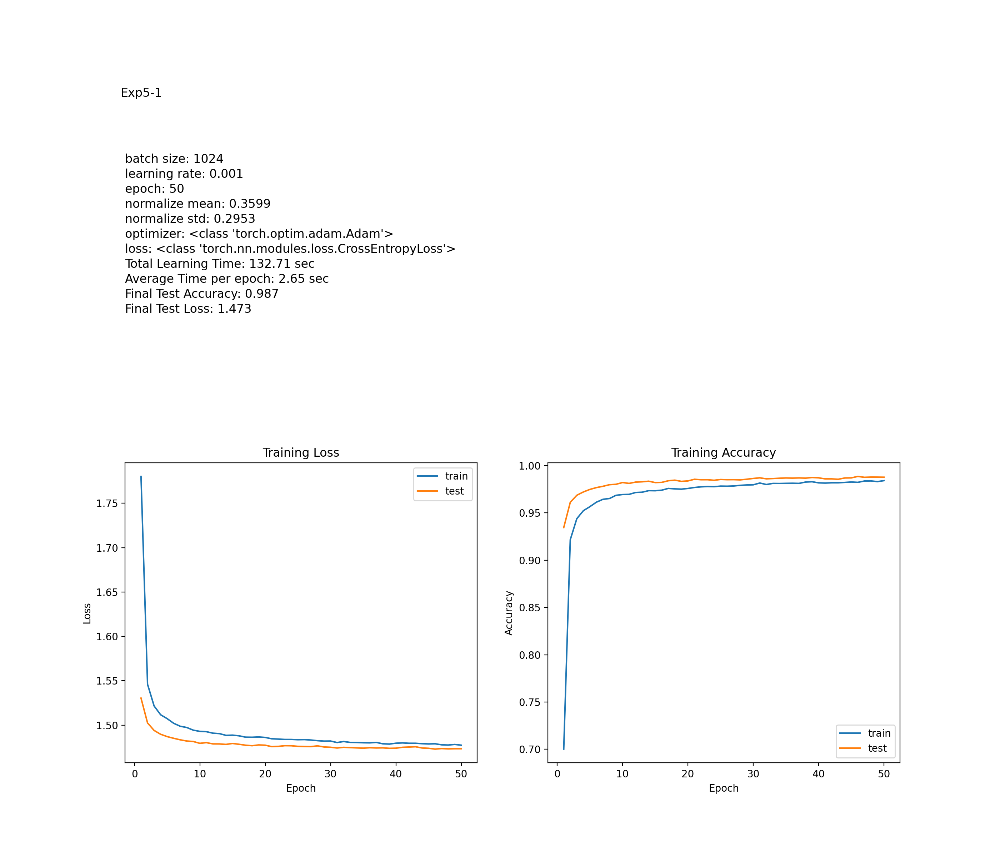

# Homework 2

## 목차
1. [실험 목표](#실험-목표)
2. [실험](#실험)
    1. [실험 설계](#실험-설계)
        1. [실험 0](#실험-0)
        2. [실험 1](#실험-1)
        3. [실험 2](#실험-2)
        4. [실험 3](#실험-3)
        5. [실험 4](#실험-4)
        6. [실험 5](#실험-5)
    2. [실험 결과 및 분석](#실험-결과-및-분석)
        1. [실험 0](#실험-0-결과)
        2. [실험 1](#실험-1-결과-및-분석)
        3. [실험 2](#실험-2-결과-및-분석)
        4. [실험 3](#실험-3-결과-및-분석)
        5. [실험 4](#실험-4-결과-및-분석)
        6. [실험 5](#실험-5-결과-및-분석)
    3. [결론](#결론)
3. [Appendix](#Appendix)  
    1. [실험 환경](#실험-환경)
    2. [코드](#코드)
        1. [필요한 라이브러리 임포트](#필요한-라이브러리-임포트)
        2. [작업 경로 설정 및 디바이스 선택](#작업-경로-설정-및-디바이스-선택)
        3. [하이퍼 파라미터 클래스 정의](#하이퍼-파라미터-클래스-정의)
        4. [CNN 모델 정의](#cnn-모델-정의)
        5. [augmentation (색반전, 경계선 추출)](#augmentation-색반전-경계선-추출)
        6. [데이터 전처리 파이프라인 설정](#데이터-전처리-파이프라인-설정)
        7. [학습 및 테스트 데이터셋 다운로드](#학습-및-테스트-데이터셋-다운로드)
        8. [데이터셋 및 모델 구조 확인](#데이터셋-및-모델-구조-확인)
        9. [experiment() 함수 정의](#experiment-함수-정의)
            1. [데이터 로더 설정](#데이터-로더-설정)
            2. [배치 크기와 라벨 확인](#배치-크기와-라벨-확인)
            3. [모델, 손실 함수, 옵티마이저 설정](#모델-손실-함수-옵티마이저-설정)
            4. [학습 루프 정의](#학습-루프-정의)
            5. [테스트 루프 정의](#테스트-루프-정의)
            6. [결과 시각화](#결과-시각화)
        10. [실험 루프 실행](#실험-루프-실행)
        11. [평균과 표준편차를 얻기 위한 코드](#평균과-표준편차를-얻기-위한-코드)

## 실험 목표
1. MNIST DB를 분류하는 분류기를 구현하고, 
2. Layer 구조와 활성화 함수, 학습률, batch size, optimizer 종류, epoch 수 등을 다양하게 적용하여 실험을 진행한다.   
3. 이후, 각각의 조건에서의 결과들을 비교하고, 그런 결과가 나온 이유를 분석한다.

---

## 실험

### 실험 설계
기본으로 다음과 같이 정의한 CNN모델을 사용하며, 실험마다 몇가지 조건을 변경하며 학습을 시키고 그 결과를 비교한다.

MNIST 데이터셋에 augmentation을 적용한다. 0.33의 확률로 이미지를 반전시킨다. 또한, 0.33의 확률로 경계선을 추출한 이미지를 사용한다. 아래는 그 예시이다.

 

기본 하이퍼파라미터는 다음과 같다.
> 
    - batch size: 1024
    - learning rate: 0.001
    - epoch: 50
    - normalize_mean: 0.5
    - normalize_std: 0.5
    - optimizer: Adam
    - loss: CrossEntropyLoss

기본 레이어 구조는 다음과 같다.
> 
    - Layer 1: convolutional layer
        - relu 
        - kernel size: 3x3
        - stride: 1
        - padding: 1
        - in: 28x28x1
        - out: 28x28x32
    - Layer 2: convolutional layer
        - relu
        - kernel size: 3x3
        - stride: 1
        - padding: 1
        - in: 28x28x32
        - out: 28x28x64
    - Layer 3: Max Pool
        - kernel size: 2x2, 
        - stride: 2
        - in: 28x28x64
        - out: 14x14x64
    - Layer 4: Dropout
        - probability: 0.25
    - Layer 5: Linear
        - relu
        - in: 64 * 14 * 14 = 12544
        - out: 128
    - Layer 6: Dropout
        - probability: 0.5
    - Layer 7: Linear
        - softmax
        - in: 128
        - out: 10

#### 실험 0
기본 하이퍼파라미터와 레이어 구조로 실험한다. 이때의 결과를 기준으로 다른 실험 결과와 비교한다. 각 실험별로 총 3번의 실험을 진행하며 각각의 성능을 평균내어 기준으로 삼는다.

실험 결과는 이미지로 저장되며, 다음 정보를 가진다.
>
    0. 모델 정보
    1. 각 epoch별로 loss와 accuracy의 변화를 나타낸 그래프
    2. 학습 시간
    3. 최종 테스트 정확도
    4. 최종 테스트 손실

추가로 로그를 통해 정확도 0.98, 0.985, 0.99를 넘어가는 epoch을 기록한다.

#### 실험 1
Layer 구조를 다음과 같이 convolutional layer 2개에서 3개로 변경하여 실험한다.
> 
    - Layer 1: convolutional layer
        - relu 
        - kernel size: 3x3
        - stride: 1
        - padding: 1
        - in: 28x28x1
        - out: 28x28x32
    - Layer 2: convolutional layer
        - relu
        - kernel size: 3x3
        - stride: 1
        - padding: 1
        - in: 28x28x32
        - out: 28x28x64
    - Layer 3: Max Pool
        - kernel size: 2x2, 
        - stride: 2
        - in: 28x28x64
        - out: 14x14x64
    - Layer 4: convolutional layer
        - relu
        - kernel size: 3x3
        - stride: 1
        - padding: 1
        - in: 14x14x64
        - out: 14x14x64
    - Layer 4: Dropout
        - probability: 0.25
    - Layer 5: Linear
        - relu
        - in: 64 * 14 * 14 = 12544
        - out: 128
    - Layer 6: Dropout
        - probability: 0.5
    - Layer 7: Linear
        - softmax
        - in: 128
        - out: 10

이 실험을 통해 레이어의 수가 늘어남에 따라 성능이 어떻게 변하는지 비교한다.

#### 실험 2
다음과 같이 마지막 레이어의 활성함수를 시그모이드로 변경하여 실험한다.
>
    - Layer 1: convolutional layer
        - relu 
        - kernel size: 3x3
        - stride: 1
        - padding: 1
        - in: 28x28x1
        - out: 28x28x32
    - Layer 2: convolutional layer
        - relu
        - kernel size: 3x3
        - stride: 1
        - padding: 1
        - in: 28x28x32
        - out: 28x28x64
    - Layer 3: Max Pool
        - kernel size: 2x2, 
        - stride: 2
        - in: 28x28x64
        - out: 14x14x64
    - Layer 4: Dropout
        - probability: 0.25
    - Layer 5: Linear
        - relu
        - in: 64 * 14 * 14 = 12544
        - out: 128
    - Layer 6: Dropout
        - probability: 0.5
    - Layer 7: Linear
        - sigmoid
        - in: 128
        - out: 10

이 실험을 통해 마지막 레이어에서 softmax를 사용하는 것이 더 좋은 성능을 낼지, 시그모이드를 사용하는 것이 더 좋은 성능을 낼지 비교한다. 

#### 실험 3
batch size를 2048로 변경하고, epoch 수를 25로, 학습률을 0.002로 변경하여 실험한다.

이 실험은 실험0에 비해 batch size를 두 배로 늘리고, epoch 수를 절반으로 줄이고, 학습률을 두 배로 늘렸다. 따라서, 실질적으로 학습하는 데이터 수와 (학습 횟수 x 학습률)은 같게 설계하였다. 

이를 통해 batch size와 epoch 수, 학습률이 성능에 어떤 영향을 미치는지 비교한다.

#### 실험 4
optimizer 종류를 Adamax로 변경하여 실험한다.

Adamax는 Adam의 변형으로, 학습률을 구할 때 기존 gradient의 2-norm 대신 infinity-norm(maximum)을 사용하는 것이 특징이다.

이를 통해 optimizer가 성능에 어떤 영향을 미치는지 비교한다.

#### 실험 5
정규화 방법을 augmentation한 데이터셋의 실제 평균과 표준편차로 변경하여 실험한다.  
이를 통해 정규화 값이 성능에 어떤 영향을 미치는지 비교한다.

얻은 평균과 표준편차는 다음과 같다.

> 
    - mean: 0.3599
    - std: 0.2953

### 실험 결과 및 분석

#### 실험 0 결과
- 실험 0-1  
      
- 실험 0-2  
    
- 실험 0-3  
    

실험 결과, 기본 CNN 네트워크의 성능은 다음과 같다. 


| 항목                  | 값         |
|---------------------|------------|
| 학습후 테스트 정확도     | 0.987       |
| 학습후 테스트 손실       | 1.4736     |
| 최초 0.98 이상 정확도 epoch | 9번째 epoch |
| 최초 0.985 이상 정확도 epoch | 19번째 epoch |
| 최초 0.99 이상 정확도 epoch | x |

#### 실험 1 결과 및 분석
- 실험 1-1  
      
- 실험 1-2  
    
- 실험 1-3  
    

실험 결과, convolutional Layer을 하나 더한 CNN 네트워크의 성능은 다음과 같다. 


| 항목                  | 값         |
|---------------------|------------|
| 학습후 테스트 정확도     | 0.989      |
| 학습후 테스트 손실       | 1.471       |
| 최초 0.98 이상 정확도 epoch | 6번째 epoch |
| 최초 0.985 이상 정확도 epoch | 11번째 epoch |
| 최초 0.99 이상 정확도 epoch | 32번째 epoch |

실험 1은 실험 0과 비교했을 때 모든 항목에서 더 나은 결과를 보여주었다.  

은닉층의 증가로 비선형성을 더 잘 표현할 수 있고, 더욱 복잡한 패턴을 학습할 수 있게 되었다. 

#### 실험 2 결과 및 분석
- 실험 2-1  
      
- 실험 2-2  
    
- 실험 2-3  
    

실험 결과, 마지막 레이어의 활성함수를 softmax에서 sigmoid로 변경한 CNN 네트워크의 성능은 다음과 같다. 


| 항목                  | 값         |
|---------------------|------------|
| 학습후 테스트 정확도     | 0.986    |
| 학습후 테스트 손실       | 1.472       |
| 최초 0.98 이상 정확도 epoch | 8번째 epoch |
| 최초 0.985 이상 정확도 epoch | 25 번째 epoch |
| 최초 0.99 이상 정확도 epoch | x |

처음 98% 이상의 정확도를 달성하는데 실험 0보다 더 빨리 달성했지만, 98.5% 이상의 정확도를 달성하는데 실험 0보다 더 오래 걸렸다. 또한, 최종 정확도는 실험 0(9.87%)보다 낮았다(98.6%).

애초에 이 실험에서는 loss 함수로 CrossEntropyLoss를 사용하였기 때문에, 마지막 레이어의 활성함수를 softmax로 사용하는 것이 더 적합하다. 왜 적합한지의 이유는 cross entropy loss의 식을 보면 알 수 있다. 

다음은 cross entropy loss의 식이다.

$$
L = -\sum_{i=0}^{9} y_i \log(p_i)
$$

여기서 $y_i$는 실제 값(정답)이고, $p_i$는 예측 값이다. 

이 식을 보면, 10개의 class중 정답인 class의 예측값이 1에 가까울 수록 loss가 작아진다. 하지만, 오답인 class의 예측값은 고려하지 않는다. 이렇게 되면, 오답인 class의 확률이 더 낮아지는 것에 대한 고려 없이 오직 정답에 대한 확률만을 고려하게 된다. 하지만 softmax를 사용하면, 정답에서의 확률을 높이는 요인으로 '오답에서의 확률을 낮추는 방향'도 고려되므로, 전체 class에 대한 확률을 고려한 loss를 구할 수 있다. 이를 통해 역전파를 하는 것이 더욱 바람직하고, 실제로 실험 결과도 이를 보여준다.

#### 실험 3 결과 및 분석
- 실험 3-1  
      
- 실험 3-2  
    
- 실험 3-3  
    

실험 결과, batch size를 2048로, epoch 수를 25로, 학습률을 0.002로 변경한 CNN 네트워크의 성능은 다음과 같다.

| 항목                  | 값         |
|---------------------|------------|
| 학습후 테스트 정확도     | 0.985  |
| 학습후 테스트 손실       | 1.475   |
| 최초 0.98 이상 정확도 epoch | 8번째 epoch |
| 최초 0.985 이상 정확도 epoch | 18번째 epoch |
| 최초 0.99 이상 정확도 epoch | x |

이 결과를 실험 0과 비교해보면, 수렴 속도가 epoch수 기준으로 근소하게(1 epoch씩) 빨라졌지만 극적인 차이는 없었다. 또한, 최종 정확도는 실험 0보다 낮았다.

여기에서 혹시나 학습률이 너무 높아서 잘 수렴하지 않는지 확인해보기 위해 학습률을 0.001로 변경하여 실험을 한 번 더 진행하였다. 그 결과는 다음과 같다.

| 항목                  | 값         |
|---------------------|------------|
| 학습후 테스트 정확도     | 0.9845  |
| 학습후 테스트 손실       | 1.477   |
| 최초 0.98 이상 정확도 epoch | 10번째 epoch |
| 최초 0.985 이상 정확도 epoch | 22번째 epoch |
| 최초 0.99 이상 정확도 epoch | x |

모든 지표가 학습률이 0.002일 때보다 좋지 않다. 

epoch의 영향을 확인해보기 위해 학습률은 0.002로 두고 epoch수를 50으로 늘려서 실험해보았다.

| 항목                  | 값         |
|---------------------|------------|
| 학습후 테스트 정확도     | 0.978  |
| 학습후 테스트 손실       | 1.433   |
| 최초 0.98 이상 정확도 epoch | 9번째 epoch |
| 최초 0.985 이상 정확도 epoch | 18번째 epoch |
| 최초 0.99 이상 정확도 epoch | x |

이 결과를 통해, epoch을 늘려도 학습률이 너무 크면 더 높은 성능을 기대할 수 없다는 것을 알 수 있다. 


따라서 성능을 높이기 위해 batch size와 epoch 수를 늘리면 일반적으로 좋은 결과를 내지만, 학습률을 적절히 조정하는 것이 최종 성능에 더 큰 영향을 미친다는 것을 알 수 있다.

#### 실험 4 결과 및 분석

- 실험 4-1  
      
- 실험 4-2  
    
- 실험 4-3  
    

실험 결과, optimizer를 Adam에서 Adamax로 변경한 CNN 네트워크의 성능은 다음과 같다.

| 항목                  | 값         |
|---------------------|------------|
| 학습후 테스트 정확도     | 0.986  |
| 학습후 테스트 손실       | 1.474  |
| 최초 0.98 이상 정확도 epoch | 15 번째 epoch | 
| 최초 0.985 이상 정확도 epoch | 34 번째 epoch | 
| 최초 0.99 이상 정확도 epoch | x | 

이는 실험 0과 비교했을 때, 성능이 좋지 않은 것을 알 수 있다. 

이것의 이유는 실험 3과 같다고 생각한다. 그 이유로, Adamax의 특성상 Adam보다 언제나 크거나 같은 학습률을 가지게 된다. 이렇게 되면 실험 3에서와 같이 학습률이 커지므로써 적절한 학습률에서 멀어지고 성능이 떨어진다.

#### 실험 5 결과 및 분석
- 실험 5-1  
      
- 실험 5-2  
    
- 실험 5-3  
    

실험 결과, 정규화 값을 augmentation한 이후의 MNIST 데이터셋의 평균과 표준편차로 변경한 CNN 네트워크의 성능은 다음과 같다.

| 항목                  | 값         |
|---------------------|------------|
| 학습후 테스트 정확도     | 0.9873  |
| 학습후 테스트 손실       | 1.476  |
| 최초 0.98 이상 정확도 epoch | 8 번째 epoch | 
| 최초 0.985 이상 정확도 epoch | 19 번째 epoch | 
| 최초 0.99 이상 정확도 epoch | x |

실험 0과 비교했을 때, 0.98의 정확도를 찍는 속도가 올랐고, 학습 이후 정확도도 소폭 향상되었다. 

다음은 알려진 정규화의 이점이다.

1. 학습 효율성 개선  
   정규화된 데이터는 모든 특징의 값 범위가 유사하게 맞춰져 모델이 특정 특징에 과도하게 의존하지 않고 고르게 학습할 수 있다. 이를 통해 모델은 특징 간의 중요성을 균등하게 반영할 수 있으며, 기울기 폭주나 소실 문제를 줄여주어 안정적인 학습이 가능하다.

2. 학습 속도 개선  
   정규화되지 않은 데이터는 특정 특징의 값이 과도하게 크거나 작은 경우가 발생하여 학습 속도를 저하시킬 수 있다. 반면, 정규화된 데이터는 가중치 최적화 과정에서 일관된 크기의 업데이트를 가능하게 하여 최적의 가중치를 더 빠르게 찾을 수 있도록 돕는다. 즉, 정규화는 학습률을 효과적으로 조정하는 역할을 하여 학습 시간을 줄일 수 있다.

3. 일반화 성능 향상  
   정규화를 통해 모델이 훈련 데이터의 분포를 일정하게 인식하게 되면, 새로운 데이터에 대해 더 나은 일반화 성능을 기대할 수 있다. 이는 특히 딥러닝 모델에서 데이터 분포의 변동에 민감하게 반응하는 특성을 안정시켜, 일관된 성능을 유지하는 데 도움이 된다.

4. 활성화 함수와의 상호작용 개선  
   정규화된 데이터는 ReLU, Sigmoid, Tanh와 같은 비선형 활성화 함수와 잘 결합된다. 예를 들어, 정규화되지 않은 입력이 Sigmoid나 Tanh 함수를 통과할 때 기울기 소실 문제가 발생할 수 있지만, 정규화를 통해 각 층에서 입력 분포를 일정하게 유지하면 모델의 표현력이 더 극대화될 수 있다.

따라서, 데이터 정규화를 통해 모델의 효율성, 속도, 일반화 능력이 전반적으로 향상되며, 이는 실험 결과에서 모델 성능 향상으로 나타날 수 있다.

그러나 이 실험에서는 입력만 정규화를 하였고 각 층에서 정규화를 하지는 않아, 그렇게 큰 성능 향상을 보이지는 않았다.

## 결론
이 실험들을 통해 다양한 하이퍼파라미터와 레이어 구조, 활성함수, 정규화 값, optimizer 등이 성능에 어떻게, 어떤 영향을 미치는지 알 수 있었다.

그러나, 하나의 실험당 시행한 횟수가 3회 뿐이라 이것을 충분히 일반화할 수는 없을 것이다. 


# Appendix

## 실험 환경
- PC
    - CPU: i5-12400F
    - RAM: 32GB
    - GPU: RTX 3070ti
    - Os: Windows 11

- Docker(WSL2)
    - VSCode
        - dev container
            - Python
            - Pytorch

## 코드
깃허브 링크 : [https://github.com/JinooLi/machine_learning/blob/main/src/hw2_MNIST/hw2_mnist_learning.py](https://github.com/JinooLi/machine_learning/blob/main/src/hw2_MNIST/hw2_mnist_learning.py)


### 필요한 라이브러리 임포트

```python
import torch
import torch.nn as nn
from torchvision import datasets, transforms
from torch.utils.data import DataLoader
from torchsummary import summary
from matplotlib import pyplot as plt
import numpy as np
import os
import time
```

---

### 작업 경로 설정 및 디바이스 선택

```python
os.chdir(os.path.dirname(os.path.realpath(__file__)))
device = torch.device("cuda" if torch.cuda.is_available() else "cpu")
print("This computer uses", device)
```

- 현재 **스크립트 위치**로 작업 경로를 설정.
- **CUDA**가 가능할 경우 GPU를, 그렇지 않으면 CPU를 사용.

---

### 하이퍼 파라미터 클래스 정의

```python
class params:
    def __init__(
        self,
        name: str = "MNIST",
        batch_size: int = 1024,
        lr: float = 0.001,
        epoch: int = 50,
        normalize_mean: float = 0.5,
        normalize_std: float = 0.5,
        optimizer: torch.optim.Optimizer = torch.optim.Adam,
        loss: nn.modules.loss._Loss = nn.CrossEntropyLoss,
    ) -> None:
        self.name = name
        self.batch_size = batch_size
        self.lr = lr
        self.epoch = epoch
        self.normalize_mean = normalize_mean
        self.normalize_std = normalize_std
        self.optimizer = optimizer
        self.loss = loss

param = params()
```
- **params** 클래스를 정의하여 하이퍼파라미터를 설정한다.
- `param` 객체를 생성하여 하이퍼파라미터를 초기화한다.

이 객체를 통해 **batch size, learning rate, epoch 수, 정규화 값, optimizer, loss 함수**를 설정할 수 있다.

---

### CNN 모델 정의

```python
class MnistTrain(nn.Module):
    def __init__(self):
        super(MnistTrain, self).__init__()
        self.layer1 = nn.Conv2d(1, 32, kernel_size=3, stride=1, padding=1)
        self.layer2 = nn.Conv2d(32, 64, kernel_size=3, stride=1, padding=1)
        self.layer3 = nn.MaxPool2d(kernel_size=2, stride=2)
        self.layer4 = nn.Dropout2d(p=0.25)
        self.layer5 = nn.Linear(64 * 14 * 14, 128)
        self.layer6 = nn.Dropout(p=0.5)
        self.layer7 = nn.Linear(128, 10)

    def forward(self, x):
        x = torch.relu(self.layer1(x))
        x = torch.relu(self.layer2(x))
        x = torch.relu(self.layer3(x))
        x = torch.relu(self.layer4(x))
        x = x.view(x.size(0), -1)
        x = torch.relu(self.layer5(x))
        x = torch.relu(self.layer6(x))
        x = torch.softmax(self.layer7(x), dim=1)
        return x
```

- **CNN 네트워크** 정의.
- 여기에선 Convolutional, MaxPooling, Dropout 및 Fully Connected 레이어를 포함한다.

---

### augmentation (색반전, 경계선 추출)
pytorch에서는 데이터 전처리를 위한 클래스를 정의하여 사용할 수 있다.

```python
class Augmentation(object):
    def __call__(self, tensor):
        rand = torch.rand(1)
        if rand > 0.66:  # 그대로
            return tensor
        elif rand > 0.33:  # 반전
            return 1 - tensor
        else:  # Edge 이미지로 변환
            tensor = (tensor > 0.5).float()
            tensor = tensor.squeeze().numpy()
            contour = np.zeros_like(tensor)
            for i in range(1, tensor.shape[0] - 1):
                for j in range(1, tensor.shape[1] - 1):
                    if tensor[i, j] == 1:
                        if (
                            tensor[i - 1, j] == 0
                            or tensor[i + 1, j] == 0
                            or tensor[i, j - 1] == 0
                            or tensor[i, j + 1] == 0
                        ):
                            contour[i, j] = 1
            return torch.tensor(contour).unsqueeze(0)
```

- 입력 텐서(이미지)를 33% 확률로 **색 반전**시킨다.  
- 33% 확률로 **경계선 추출** 이미지로 변환한다.  
    경계선 추출은 **이미지의 픽셀값이 0.5 이상인 부분을 1로, 0.5 미만인 부분을 0으로** 변환한다.  
    이후, **경계선 부분**을 찾아 **1로 변환**한다.
- 나머지 33%는 **원본 이미지**를 반환한다.

---

### 데이터 전처리 파이프라인 설정

```python
transform = transforms.Compose([
    transforms.ToTensor(),  
    Augmentation(),  
    mean=(param.normalize_mean,), std=(param.normalize_std,) 
])
```

- **`ToTensor()`**: 이미지를 (0,1) 범위의 텐서로 변환.
- **`Augmentation()`**: 색을 랜덤으로 반전하거나 경계선을 추출하여 이미지 변환.
- **정규화**: param 객체에서 정한 평균과 표준편차로 이미지 정규화.

---

### 학습 및 테스트 데이터셋 다운로드

```python
train_dataset = datasets.MNIST(
    root="./data", train=True, download=True, transform=transform
)

test_dataset = datasets.MNIST(
    root="./data", train=False, download=True, transform=transform
)
```

- **MNIST 데이터셋**을 다운로드하고 전처리한다.

---

### 데이터셋 및 모델 구조 확인

```python
# 데이터셋 9개 출력
img_loader = DataLoader(train_dataset, batch_size=9, shuffle=True)
images, labels = next(iter(img_loader))

fig, axes = plt.subplots(3, 3, figsize=(10, 10))
fig.suptitle("train_dataset", fontsize=16)

for i in range(9):
    ax = axes[i // 3, i % 3]
    ax.imshow(images[i].squeeze(), cmap="gray")
    ax.set_title(f"Label: {labels[i]}")
    ax.axis("off")

plt.savefig("train_dataset.png", dpi=200)

# 모델 구조 출력
summary(MnistTrain(), (1, 28, 28))
```

- **train_dataset**에서 **9개의 이미지**를 출력. 전처리가 잘 되었는지 확인한다.
- **MnistTrain** 모델의 구조를 출력한다.

---

### experiment() 함수 정의
이 함수 안에 학습 및 테스트 루프를 정의한다. 이를 통해 실험을 n번 반복하고 결과를 비교할 수 있다.

#### 데이터 로더 설정

```python
    train_loader = DataLoader(
        train_dataset, batch_size=param.batch_size, shuffle=True, num_workers=4
    )
    test_loader = DataLoader(
        test_dataset, batch_size=1024, shuffle=False, num_workers=4
    )
```

- **train_loader**: 학습 데이터셋을 불러온다. 배치 사이즈는 param 객체에서 설정한 값으로 하며, 셔플을 수행한다.
- **test_loader**: 테스트 데이터셋을 불러온다. 배치 사이즈는 1024로 설정하며, 셔플을 수행하지 않는다.


#### 배치 크기와 라벨 확인
    
```python
examples = enumerate(train_loader)
batch_idx, (example_data, example_targets) = next(examples)
print(f"예시 이미지 배치 크기: {example_data.size()}")
print(f"예시 라벨: {example_targets}")
```


#### 모델, 손실 함수, 옵티마이저 설정

```python
model = MnistTrain().to(device)
criterion = param.loss()
optimizer = param.optimizer(model.parameters(), lr=param.lr)
print("loss function: ", criterion)
print("optimizer: ", optimizer)
```

- loss 함수와 옵티마이저를 설정한다.
- 기본적으로 **크로스 엔트로피 손실**과 **Adam 옵티마이저**를 사용한다.

---

#### 학습 루프 정의

```python
history = []
accuracy_mean = []
history_test = []
test_accuracy_mean = []
total_time = 0
for _epoch in range(param.epoch):
    start_time = time.time()
    model.train()
    total, total_loss, total_accuracy = 0, 0, 0
    for data, target in train_loader:
        data, target = data.to(device), target.to(device)
        target = torch.nn.functional.one_hot(target, num_classes=10).type(torch.float32)

        optimizer.zero_grad()
        output = model(data)
        loss = criterion(output, target)
        loss.backward()
        optimizer.step()

        total_loss += loss.item()
        accuracy = (output.argmax(1) == target.argmax(1)).float().mean().item()
        total_accuracy += accuracy
        total += 1

    end_time = time.time()
    total_time += end_time - start_time

    history.append(total_loss / total)
    accuracy_mean.append(total_accuracy / total)
```

- **50번의 epoch** 동안 학습.
- **Gradient 초기화**, **역전파**, **가중치 업데이트**를 수행.
- 각 batch의 **손실과 정확도, 시간**을 기록.

---

#### 테스트 루프 정의

```python
model.eval()
test_loss = 0
total = 0
total_accuracy = 0
with torch.no_grad():
    for data, target in test_loader:
        data, target = data.to(device), target.to(device)
        target = torch.nn.functional.one_hot(target, num_classes=10).type(torch.float32)

        output = model(data)
        test_loss += criterion(output, target).item()
        accuracy = (output.argmax(1) == target.argmax(1)).float().mean().item()
        total_accuracy += accuracy
        total += 1

        numpy_output = output.detach().cpu().numpy()
        numpy_target = target.detach().cpu().numpy()
        numpy_output = numpy_output.argmax(axis=1)
        numpy_target = numpy_target.argmax(axis=1)
        correct_count = (numpy_output == numpy_target).sum()
        accuracy = correct_count / len(numpy_output)
        total_accuracy += accuracy

    history_test.append(test_loss / total)
    test_accuracy_mean.append(total_accuracy / total)

    print(
        f"\rEpoch: {_epoch+1:2d}, Test Loss: {history_test[-1]:.4f}, Test Accuracy: {test_accuracy_mean[-1]:.4f}, Learning Time: {end_time - start_time:.2f} sec"
    )
```

- **학습이 끝난 후** 테스트 데이터로 평가
- **기록된 손실과 정확도**를 저장

---

#### 결과 시각화

```python
plt.figure(figsize=(14, 12))
plt.tight_layout()
# params 내용 출력
plt.subplot(2, 20, 1)
plt.title(param.name)
plt.text(0, 0.8, "batch size: " + str(param.batch_size), fontsize=12, ha="left")
plt.text(0, 0.75, "learning rate: " + str(param.lr), fontsize=12, ha="left")
plt.text(0, 0.7, "epoch: " + str(param.epoch), fontsize=12, ha="left")
plt.text(
    0, 0.65, "normalize mean: " + str(param.normalize_mean), fontsize=12, ha="left"
)
plt.text(0, 0.6, "normalize std: " + str(param.normalize_std), fontsize=12, ha="left")
plt.text(0, 0.55, "optimizer: " + str(param.optimizer), fontsize=12, ha="left")
plt.text(0, 0.5, "loss: " + str(param.loss), fontsize=12, ha="left")
plt.text(
    0,
    0.45,
    "Total Learning Time: " + str((total_time // 0.01) / 100) + " sec",
    fontsize=12,
    ha="left",
)
plt.text(
    0,
    0.4,
    "Average Time per epoch: "
    + str(((total_time / param.epoch) // 0.01) / 100)
    + " sec",
    fontsize=12,
    ha="left",
)
plt.text(
    0,
    0.35,
    "Final Test Accuracy: " + str((test_accuracy_mean[-1] // 0.001) / 1000),
    fontsize=12,
    ha="left",
)
plt.text(
    0,
    0.3,
    "Final Test Loss: " + str((history_test[-1] // 0.001) / 1000),
    fontsize=12,
    ha="left",
)
plt.axis("off")
plt.subplot(2, 2, 3)
plt.plot(np.linspace(1, len(history), len(history)), history)
plt.plot(np.linspace(1, len(history), len(history)), history_test)
plt.xlabel("Epoch")
plt.ylabel("Loss")
plt.legend(["train", "test"])

plt.subplot(2, 2, 4)
plt.plot(np.linspace(1, len(accuracy_mean), len(accuracy_mean)), accuracy_mean)
plt.plot(np.linspace(1, len(accuracy_mean), len(accuracy_mean)), test_accuracy_mean)
plt.xlabel("Epoch")
plt.ylabel("Accuracy")
plt.legend(["train", "test"])

plt.savefig("Loss-Accuracy.png", dpi=100)
plt.close()
```
- **모델 정보**와 **학습 시간, 테스트 정확도**를 출력.
- **손실과 정확도**의 변화를 그래프로 시각화 및 저장.

---

### 실험 루프 실행

```python
for i in range(3):
    experiment("Exp5-" + str(i + 1))
```

- 실험의 이름을 설정하고 실험을 반복한다.

### 평균과 표준편차를 얻기 위한 코드
학습할 때 사용하는 코드에는 생략하였다.

```python
transform2 = transforms.Compose(
    [
        transforms.ToTensor(),  # 이미지를 (0,1) 범위의 텐서로 변환
        Augmentation(),  # 이미지를 랜덤으로 반전하거나 엣지 이미지로 변환
    ]
)
dataset = datasets.MNIST(root="./data", train=True, download=True, transform=transform2)
loader = DataLoader(dataset, batch_size=2048, shuffle=True)

# 모든 배치를 순회하면서 평균과 표준편차 계산
mean = 0.0
std = 0.0
total_images = 0

for images, _ in loader:
    batch_samples = images.size(0)  # 배치 크기
    images = images.view(batch_samples, images.size(1), -1)  # 이미지 펼치기
    mean += images.mean(2).sum(0)  # 채널별 평균 합산
    std += images.std(2).sum(0)  # 채널별 표준편차 합산
    total_images += batch_samples

mean /= total_images
std /= total_images

print(f"Augmented Dataset Mean: {mean}")
print(f"Augmented Dataset Std: {std}")
```

- **Augmentation**을 적용한 데이터셋의 **평균과 표준편차**를 계산한다.