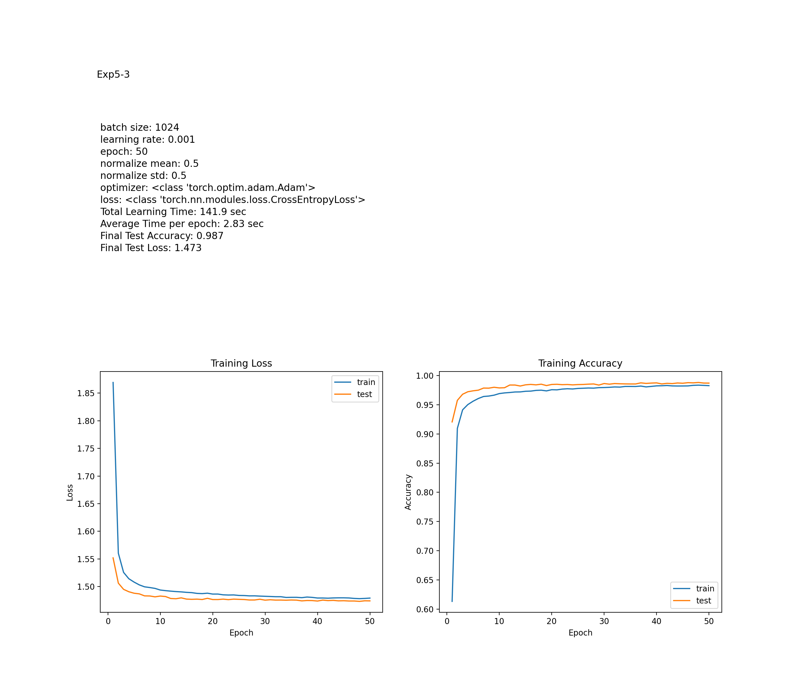
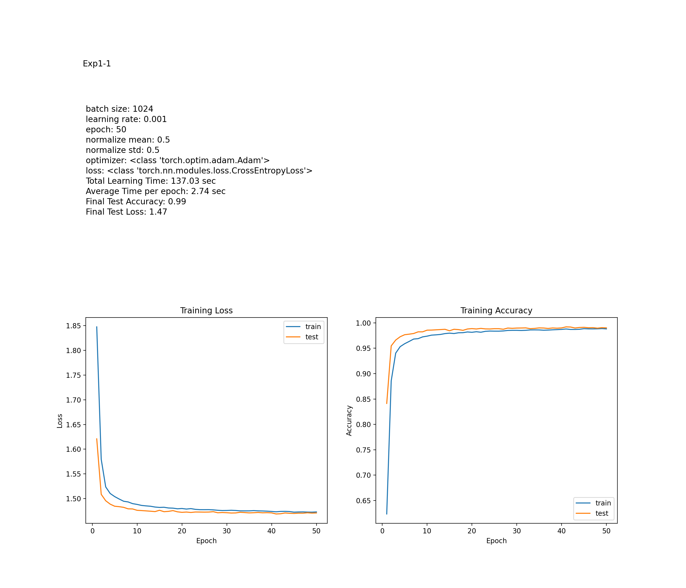
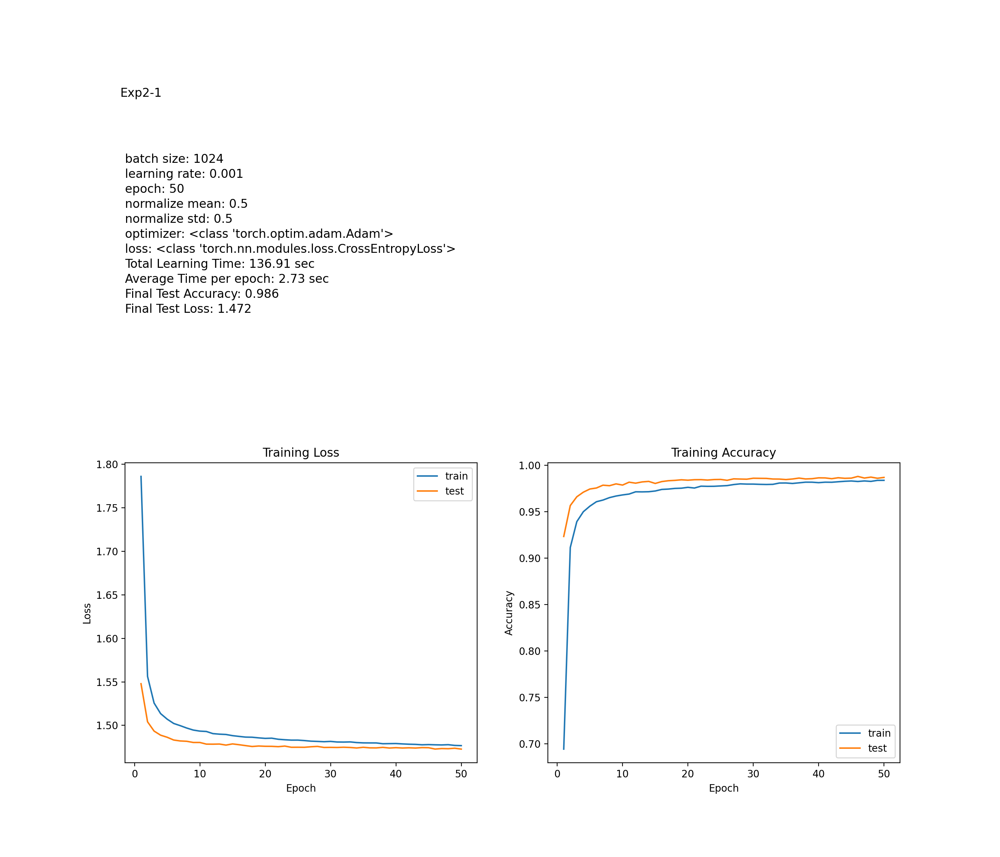

# Homework 2

## 목차
1. [실험 목표](##실험-목표)
2. [실험](##실험)
    1. [실험 설계](###실험-설계)
    2. [실험 결과 및 분석](###실험-결과-및-분석)
3. [Appendix](#Appendix)  
    1. [MNIST 분류기 구성](##MNIST-분류기-구성)

## 실험 목표
1. MNIST DB를 분류하는 분류기를 구현하고, 
2. Layer 구조와 활성화 함수, 학습률, batch size, optimizer 종류, epoch 수 등을 다양하게 적용하여 실험을 진행한다.   
3. 이후, 각각의 조건에서의 결과들을 비교하고, 그런 결과가 나온 이유를 분석한다.

---

## 실험

### 실험 설계
기본으로 다음과 같이 정의한 CNN모델을 사용하며, 실험마다 몇가지 조건을 변경하며 학습을 시키고 그 결과를 비교한다.

MNIST 데이터셋에 augmentation을 적용한다. 0.33의 확률로 이미지를 반전시킨다. 또한, 0.33의 확률로 경계선을 추출한 이미지를 사용한다. 아래는 그 예시이다.

 

기본 하이퍼파라미터는 다음과 같다.
> 
    - batch size: 1024
    - learning rate: 0.001
    - epoch: 50
    - normalize_mean: 0.5
    - normalize_std: 0.5
    - optimizer: Adam
    - loss: CrossEntropyLoss

기본 레이어 구조는 다음과 같다.
> 
    - Layer 1: convolutional layer
        - relu 
        - kernel size: 3x3
        - stride: 1
        - padding: 1
        - in: 28x28x1
        - out: 28x28x32
    - Layer 2: convolutional layer
        - relu
        - kernel size: 3x3
        - stride: 1
        - padding: 1
        - in: 28x28x32
        - out: 28x28x64
    - Layer 3: Max Pool
        - kernel size: 2x2, 
        - stride: 2
        - in: 28x28x64
        - out: 14x14x64
    - Layer 4: Dropout
        - probability: 0.25
    - Layer 5: Linear
        - relu
        - in: 64 * 14 * 14 = 12544
        - out: 128
    - Layer 6: Dropout
        - probability: 0.5
    - Layer 7: Linear
        - softmax
        - in: 128
        - out: 10

#### 실험 0
기본 하이퍼파라미터와 레이어 구조로 실험한다. 이때의 결과를 기준으로 다른 실험 결과와 비교한다. 각 실험별로 총 3번의 실험을 진행하며 각각의 성능을 평균내어 기준으로 삼는다.

실험 결과는 이미지로 저장되며, 다음 정보를 가진다.
>
    0. 모델 정보
    1. 각 epoch별로 loss와 accuracy의 변화를 나타낸 그래프
    2. 학습 시간
    3. 최종 테스트 정확도
    4. 최종 테스트 손실

추가로 로그를 통해 정확도 0.98, 0.985, 0.99를 넘어가는 epoch을 기록한다.

#### 실험 1
Layer 구조를 다음과 같이 convolutional layer 2개에서 3개로 변경하여 실험한다.
> 
    - Layer 1: convolutional layer
        - relu 
        - kernel size: 3x3
        - stride: 1
        - padding: 1
        - in: 28x28x1
        - out: 28x28x32
    - Layer 2: convolutional layer
        - relu
        - kernel size: 3x3
        - stride: 1
        - padding: 1
        - in: 28x28x32
        - out: 28x28x64
    - Layer 3: Max Pool
        - kernel size: 2x2, 
        - stride: 2
        - in: 28x28x64
        - out: 14x14x64
    - Layer 4: convolutional layer
        - relu
        - kernel size: 3x3
        - stride: 1
        - padding: 1
        - in: 14x14x64
        - out: 14x14x64
    - Layer 4: Dropout
        - probability: 0.25
    - Layer 5: Linear
        - relu
        - in: 64 * 14 * 14 = 12544
        - out: 128
    - Layer 6: Dropout
        - probability: 0.5
    - Layer 7: Linear
        - softmax
        - in: 128
        - out: 10

이 실험을 통해 레이어의 수가 늘어남에 따라 성능이 어떻게 변하는지 비교한다.

#### 실험 2
다음과 같이 마지막 레이어의 활성함수를 시그모이드로 변경하여 실험한다.
>
    - Layer 1: convolutional layer
        - relu 
        - kernel size: 3x3
        - stride: 1
        - padding: 1
        - in: 28x28x1
        - out: 28x28x32
    - Layer 2: convolutional layer
        - relu
        - kernel size: 3x3
        - stride: 1
        - padding: 1
        - in: 28x28x32
        - out: 28x28x64
    - Layer 3: Max Pool
        - kernel size: 2x2, 
        - stride: 2
        - in: 28x28x64
        - out: 14x14x64
    - Layer 4: Dropout
        - probability: 0.25
    - Layer 5: Linear
        - relu
        - in: 64 * 14 * 14 = 12544
        - out: 128
    - Layer 6: Dropout
        - probability: 0.5
    - Layer 7: Linear
        - sigmoid
        - in: 128
        - out: 10

이 실험을 통해 마지막 레이어에서 softmax를 사용하는 것이 더 좋은 성능을 낼지, 시그모이드를 사용하는 것이 더 좋은 성능을 낼지 비교한다. 

#### 실험 3
batch size를 2048로 변경하고, epoch 수를 25로, 학습률을 0.002로 변경하여 실험한다.

이전 실험 0과 비교하였을 때, 학습의 횟수 자체는 같고, 데이터 수 대비 사용되는 학습률도 기존과 같게 설계하였다.

이를 통해 batch size와 epoch 수, 학습률이 성능에 어떤 영향을 미치는지 비교한다.

#### 실험 4
optimizer 종류를 Adamax로 변경하여 실험한다.

이를 통해 optimizer가 성능에 어떤 영향을 미치는지 비교한다.

#### 실험 5
정규화 방법을 mean=0.1307, std=0.3081로 변경하여 실험한다.(이는 MNIST 데이터셋의 평균과 표준편차이다.)

이를 통해 정규화 값이 성능에 어떤 영향을 미치는지 비교한다.

### 실험 결과 및 분석

#### 실험 0
- 실험 0-1  
      
- 실험 0-2  
    
- 실험 0-3  
    

실험 결과, 기본 CNN 네트워크의 성능은 다음과 같다. 


| 항목                  | 값         |
|---------------------|------------|
| 학습후 테스트 정확도     | 0.9885       |
| 학습후 테스트 손실       | 1.4729     |
| 최초 0.98 이상 정확도 epoch | 9번째 epoch |
| 최초 0.985 이상 정확도 epoch | 19번째 epoch |
| 최초 0.99 이상 정확도 epoch | x |

#### 실험 1
- 실험 1-1  
      
- 실험 1-2  
    
- 실험 1-3  
    

실험 결과, convolutional Layer을 하나 더한 CNN 네트워크의 성능은 다음과 같다. 


| 항목                  | 값         |
|---------------------|------------|
| 학습후 테스트 정확도     | 0.989      |
| 학습후 테스트 손실       | 1.471       |
| 최초 0.98 이상 정확도 epoch | 6번째 epoch |
| 최초 0.985 이상 정확도 epoch | 11번째 epoch |
| 최초 0.99 이상 정확도 epoch | 32번째 epoch |

#### 실험 2
- 실험 2-1  
      
- 실험 2-2  
    
- 실험 2-3  
    

실험 결과, 마지막 레이어의 활성함수를 softmax에서 sigmoid로 변경한 CNN 네트워크의 성능은 다음과 같다. 


| 항목                  | 값         |
|---------------------|------------|
| 학습후 테스트 정확도     | 0.986    |
| 학습후 테스트 손실       | 1.472       |
| 최초 0.98 이상 정확도 epoch | 8번째 epoch |
| 최초 0.985 이상 정확도 epoch | 25 번째 epoch |
| 최초 0.99 이상 정확도 epoch | x |


#### 실험 3
- 실험 3-1  
      
- 실험 3-2  
    
- 실험 3-3  
    

실험 결과, batch size를 2048로, epoch 수를 25로, 학습률을 0.002로 변경한 CNN 네트워크의 성능은 다음과 같다.

| 항목                  | 값         |
|---------------------|------------|
| 학습후 테스트 정확도     | 0.985  |
| 학습후 테스트 손실       | 1.475   |
| 최초 0.98 이상 정확도 epoch | 8번째 epoch |
| 최초 0.985 이상 정확도 epoch | 18번째 epoch |
| 최초 0.99 이상 정확도 epoch | x |

#### 실험 4

- 실험 4-1  
      
- 실험 4-2  
    
- 실험 4-3  
    

실험 결과, optimizer를 Adam에서 Adamax로 변경한 CNN 네트워크의 성능은 다음과 같다.

| 항목                  | 값         |
|---------------------|------------|
| 학습후 테스트 정확도     | 0.986  |
| 학습후 테스트 손실       | 1.474  |
| 최초 0.98 이상 정확도 epoch | 15 번째 epoch | 
| 최초 0.985 이상 정확도 epoch | 34 번째 epoch | 
| 최초 0.99 이상 정확도 epoch | x | 


#### 실험 5
- 실험 5-1  
      
- 실험 5-2  
    
- 실험 5-3  
    

실험 결과, 정규화 값을 MNIST 데이터셋의 평균과 표준편차로 변경한 CNN 네트워크의 성능은 다음과 같다.

| 항목                  | 값         |
|---------------------|------------|
| 학습후 테스트 정확도     | 0.987  |
| 학습후 테스트 손실       | 1.47  |
| 최초 0.98 이상 정확도 epoch | 9 번째 epoch | 
| 최초 0.985 이상 정확도 epoch | 19 번째 epoch | 
| 최초 0.99 이상 정확도 epoch | x |


# Appendix

## MNIST 분류기 구성 

### 환경
- PC
    - CPU: i5-12400F
    - RAM: 32GB
    - GPU: RTX 3070ti
- Docker(WSL2)
- VSCode
    - dev container
- Python
    - Pytorch
    - Torchvision
    - Numpy
    - Matplotlib

### 코드
깃허브 링크 : [https://github.com/JinooLi/machine_learning/blob/main/src/hw2_MNIST/hw2_mnist_learning.py](https://github.com/JinooLi/machine_learning/blob/main/src/hw2_MNIST/hw2_mnist_learning.py)


#### 1. 필요한 라이브러리 임포트

```python
import torch
import torch.nn as nn
from torchvision import datasets, transforms
from torch.utils.data import DataLoader
from torchsummary import summary
from matplotlib import pyplot as plt
import numpy as np
import os
import time
```

---

#### 2. 파라미터 클래스 정의

```python
class params:
    def __init__(self, batch_size=1024, lr=0.001, epoch=50, 
                 normalize_mean=0.5, normalize_std=0.5, 
                 optimizer=torch.optim.Adam, loss=nn.CrossEntropyLoss):
        self.batch_size = batch_size
        self.lr = lr
        self.epoch = epoch
        self.normalize_mean = normalize_mean
        self.normalize_std = normalize_std
        self.optimizer = optimizer
        self.loss = loss

param = params()
```
- **params** 클래스를 정의하여 하이퍼파라미터를 설정한다.
- `param` 객체를 생성하여 하이퍼파라미터를 초기화한다.

이 객체를 통해 **batch size, learning rate, epoch 수, 정규화 값, optimizer, loss 함수**를 설정할 수 있다.

---

#### 3. 작업 경로 설정 및 디바이스 선택

```python
os.chdir(os.path.dirname(os.path.realpath(__file__)))
device = torch.device("cuda" if torch.cuda.is_available() else "cpu")
print("This computer uses", device)
```

- 현재 **스크립트 위치**로 작업 경로를 설정.
- **CUDA**가 가능할 경우 GPU를, 그렇지 않으면 CPU를 사용.

---

#### 4. 사용자 정의 색 반전 클래스 정의

```python
class RandomInvertColor(object):
    def __call__(self, tensor):
        if torch.rand(1) > 0.5:
            return tensor
        return 1 - tensor  # 색상 반전
```

- 입력 텐서(이미지)를 50% 확률로 **색 반전**시킨다.  
이는 데이터 **증강**(augmentation)을 위한 것이다.

---

#### 5. 데이터 전처리 파이프라인 설정

```python
transform = transforms.Compose([
    transforms.ToTensor(),  
    RandomInvertColor(),  
    transforms.Normalize(mean=(0.5,), std=(0.5,))  
])
```

- **`ToTensor()`**: 이미지를 (0,1) 범위의 텐서로 변환.
- **`RandomInvertColor()`**: 색을 랜덤으로 반전.
- **정규화**: 평균 0.5, 표준편차 0.5로 이미지 정규화.  
    원래 MNIST의 평균과 표준편차는 0.1307, 0.3081이지만, 50% 확률로 색 반전을 수행하므로 이 값은 변경됨.

---

#### 6. 데이터셋 및 데이터 로더 설정

```python
train_dataset = datasets.MNIST(root="./data", train=True, download=True, transform=transform)
test_dataset = datasets.MNIST(root="./data", train=False, download=True, transform=transform)

train_loader = DataLoader(train_dataset, batch_size=1024, shuffle=True)
test_loader = DataLoader(test_dataset, batch_size=1024, shuffle=False)
```

- **MNIST 데이터셋**을 다운로드하고 전처리한다.
- **DataLoader**로 데이터를 **배치(batch)** 단위로 로드.

---

#### 7. 데이터셋 예시 확인

```python
examples = enumerate(train_loader)
batch_idx, (example_data, example_targets) = next(examples)
print(f"예시 이미지 배치 크기: {example_data.size()}")
print(f"예시 라벨: {example_targets}")
```

- 첫 번째 배치 데이터를 로드하여 **이미지 크기**와 **라벨** 출력.

---

#### 8. CNN 모델 정의

```python
class MnistTrain(nn.Module):
    def __init__(self):
        super(MnistTrain, self).__init__()
        self.layer1 = nn.Conv2d(1, 32, kernel_size=3, stride=1, padding=1)
        self.layer2 = nn.Conv2d(32, 64, kernel_size=3, stride=1, padding=1)
        self.layer3 = nn.MaxPool2d(kernel_size=2, stride=2)
        self.layer4 = nn.Dropout2d(p=0.25)
        self.layer5 = nn.Linear(64 * 14 * 14, 128)
        self.layer6 = nn.Dropout(p=0.5)
        self.layer7 = nn.Linear(128, 10)

    def forward(self, x):
        x = torch.relu(self.layer1(x))
        x = torch.relu(self.layer2(x))
        x = torch.relu(self.layer3(x))
        x = torch.relu(self.layer4(x))
        x = x.view(x.size(0), -1)
        x = torch.relu(self.layer5(x))
        x = torch.relu(self.layer6(x))
        x = torch.softmax(self.layer7(x), dim=1)
        return x
```

- **CNN 네트워크** 정의.
- 여기에선 Convolutional, MaxPooling, Dropout 및 Fully Connected 레이어를 포함한다.

---

#### 9. 손실 함수 및 옵티마이저 설정

```python
model = MnistTrain().to(device)
criterion = param.loss()
optimizer = param.optimizer(model.parameters(), lr=param.lr)
```

- loss 함수와 옵티마이저를 설정한다.
- 기본적으로 **크로스 엔트로피 손실**과 **Adam 옵티마이저**를 사용한다.

---

#### 10. 학습 루프 정의

```python
history = []
accuracy_mean = []
history_test = []
test_accuracy_mean = []
total_time = 0
for _epoch in range(param.epoch):
    start_time = time.time()
    model.train()
    total, total_loss, total_accuracy = 0, 0, 0
    for data, target in train_loader:
        data, target = data.to(device), target.to(device)
        target = torch.nn.functional.one_hot(target, num_classes=10).type(torch.float32)

        optimizer.zero_grad()
        output = model(data)
        loss = criterion(output, target)
        loss.backward()
        optimizer.step()

        total_loss += loss.item()
        accuracy = (output.argmax(1) == target.argmax(1)).float().mean().item()
        total_accuracy += accuracy
        total += 1

    end_time = time.time()
    total_time += end_time - start_time

    history.append(total_loss / total)
    accuracy_mean.append(total_accuracy / total)
```

- **50번의 epoch** 동안 학습.
- **Gradient 초기화**, **역전파**, **가중치 업데이트**를 수행.
- 각 batch의 **손실과 정확도, 시간**을 기록.

---

#### 11. 테스트 루프 정의

```python
model.eval()
test_loss, total, total_accuracy = 0, 0, 0
with torch.no_grad():
    for data, target in test_loader:
        data, target = data.to(device), target.to(device)
        target = torch.nn.functional.one_hot(target, num_classes=10).type(torch.float32)

        output = model(data)
        test_loss += criterion(output, target).item()
        accuracy = (output.argmax(1) == target.argmax(1)).float().mean().item()
        total_accuracy += accuracy
        total += 1

    history_test.append(test_loss / total)
    test_accuracy_mean.append(total_accuracy / total)
```

- **학습이 끝난 후** 테스트 데이터로 평가
- **기록된 손실과 정확도**를 저장

---

#### 12. 결과 시각화

```python
plt.figure(figsize=(14, 12))
plt.tight_layout()
# params 내용 출력
plt.subplot(2, 20, 1)
plt.title(param.name)
plt.text(0, 0.8, "batch size: " + str(param.batch_size), fontsize=12, ha="left")
plt.text(0, 0.75, "learning rate: " + str(param.lr), fontsize=12, ha="left")
plt.text(0, 0.7, "epoch: " + str(param.epoch), fontsize=12, ha="left")
plt.text(
    0, 0.65, "normalize mean: " + str(param.normalize_mean), fontsize=12, ha="left"
)
plt.text(0, 0.6, "normalize std: " + str(param.normalize_std), fontsize=12, ha="left")
plt.text(0, 0.55, "optimizer: " + str(param.optimizer), fontsize=12, ha="left")
plt.text(0, 0.5, "loss: " + str(param.loss), fontsize=12, ha="left")
plt.text(
    0,
    0.45,
    "Total Learning Time: " + str((total_time // 0.01) / 100) + " sec",
    fontsize=12,
    ha="left",
)
plt.text(
    0,
    0.4,
    "Average Time per epoch: "
    + str(((total_time / param.epoch) // 0.01) / 100)
    + " sec",
    fontsize=12,
    ha="left",
)
plt.text(
    0,
    0.35,
    "Final Test Accuracy: " + str((test_accuracy_mean[-1] // 0.001) / 1000),
    fontsize=12,
    ha="left",
)
plt.text(
    0,
    0.3,
    "Final Test Loss: " + str((history_test[-1] // 0.001) / 1000),
    fontsize=12,
    ha="left",
)
plt.axis("off")
plt.subplot(2, 2, 3)
plt.plot(np.linspace(1, len(history), len(history)), history)
plt.plot(np.linspace(1, len(history), len(history)), history_test)
plt.xlabel("Epoch")
plt.ylabel("Loss")
plt.legend(["train", "test"])

plt.subplot(2, 2, 4)
plt.plot(np.linspace(1, len(accuracy_mean), len(accuracy_mean)), accuracy_mean)
plt.plot(np.linspace(1, len(accuracy_mean), len(accuracy_mean)), test_accuracy_mean)
plt.xlabel("Epoch")
plt.ylabel("Accuracy")
plt.legend(["train", "test"])

plt.savefig("Loss-Accuracy.png", dpi=100)
plt.close()
```
- **모델 정보**와 **학습 시간, 테스트 정확도**를 출력.
- **손실과 정확도**의 변화를 그래프로 시각화 및 저장.

